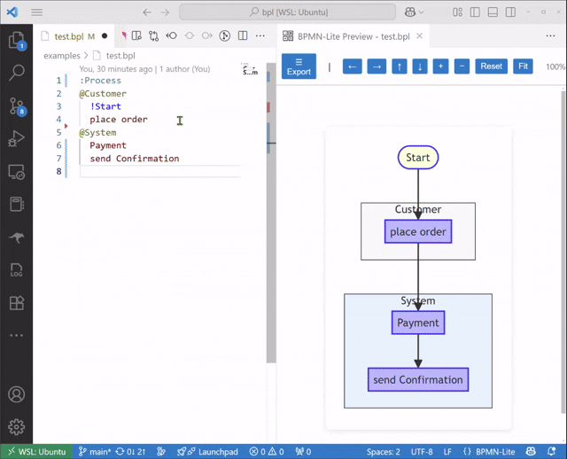
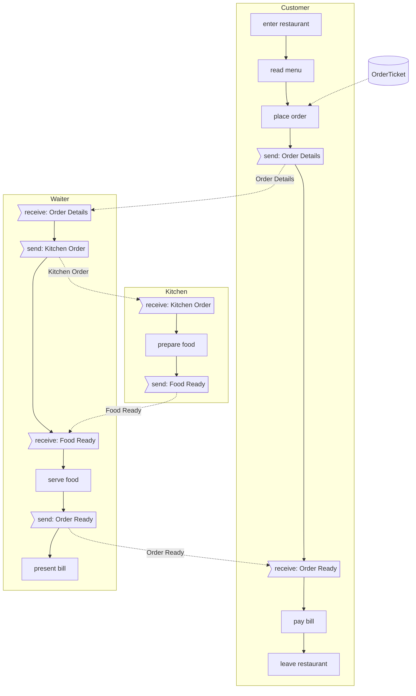
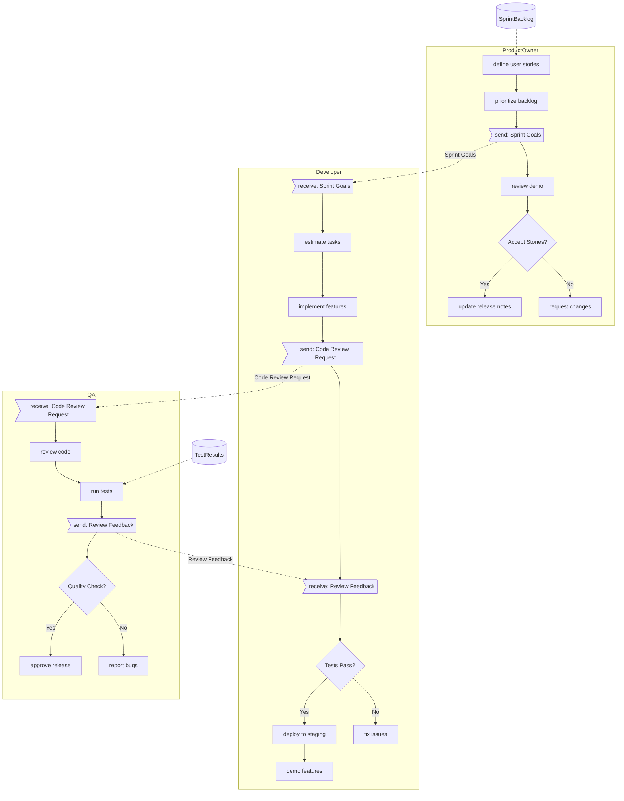
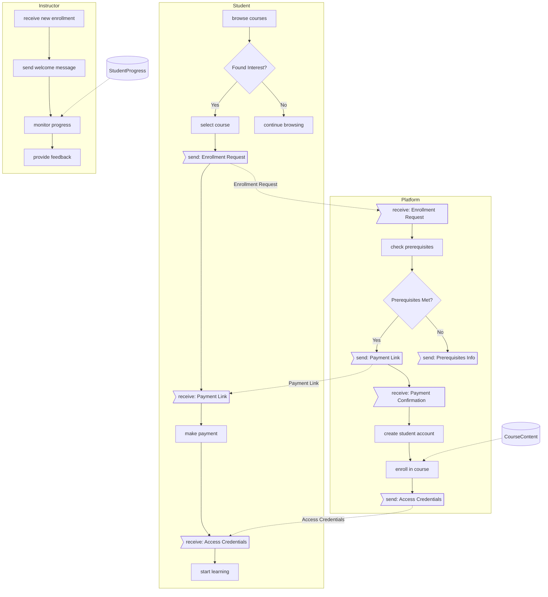

# BPMN-Lite Editor

A revolutionary way to create business process diagrams - write in plain text, see beautiful diagrams instantly! 🚀

<p align="center">
  
  
  
</p>

## 🎯 Why BPMN-Lite?

Stop wrestling with complex diagramming tools! BPMN-Lite lets you describe business processes in simple, intuitive text that automatically transforms into professional diagrams.

```
@Customer
  place order
  send: Payment
  receive: Confirmation

@System  
  receive: Payment
  ?Payment Valid
    +ship order
    -cancel order
  send: Confirmation
```

**↓ Instantly becomes ↓**



A beautiful, interactive BPMN diagram!

## ✨ Key Features

### 📝 **Simple DSL Syntax**
Write business processes in plain text - no XML, no drag-and-drop, just intuitive notation

### 👁️ **Live Preview** 
See your diagram update in real-time as you type (with VS Code extension!)

### 🎭 **Multiple Views**
Switch between:
- 📊 **Diagram View** - Interactive Mermaid flowchart
- 🌳 **AST View** - Understand the parsed structure
- 📜 **Mermaid Code** - Export-ready diagram syntax

### 🔀 **Smart Connectivity**
- **Gateway Support**: XOR decisions with custom branch labels
- **End Event Normalization**: Smart handling of `!End`, `+!End`, `-!End` variations
- **Auto-Connection Breaks**: Intelligent flow termination to prevent cross-lane leakage
- **Message Flows**: Automatic connection between send/receive tasks
- **Cross-Lane Flows**: Automatic sequential task connectivity with break detection
- **Data Objects**: Attach data to any process step

### 📤 **Export Options**
- `.bpl` - Source code format
- `.json` - Abstract Syntax Tree
- `.mmd` - Mermaid diagram code  
- `.png` - High-resolution PNG images (with custom DPI)
- `.svg` - Scalable vector graphics
- `.xlsx` - Excel format for Visio import
- `.bpmn` - Native BPMN 2.0 XML (Camunda 8 compatible)

## 🚀 Getting Started

### Option 1: Web-Based Editor (Easiest)

```bash
# Clone and setup
git clone <repository-url>
cd bpl
npm install
npm run build

# Launch in browser
npm run start:web
```

Open http://localhost:8080 and start creating!

### Option 2: Desktop Application

```bash
# Same setup as above, then:
npm start
```

### Option 3: VS Code Extension (Recommended!) 

Get the ultimate experience with live preview as you type:

```bash
cd vscode-bpmn-lite
npm install
npm run compile

# In VS Code: Press F5 to test
# Or package for installation:
npm run package
```

### Excel Export Setup (Optional)

```bash
cd tools
pip install -r requirements.txt
```

## 📖 BPMN-lite DSL Specification

### Purpose

A minimal, intuitive domain-specific language for describing business process diagrams that can be rendered to both BPMN and Mermaid formats. The DSL prioritizes simplicity, readability, and expressiveness while minimizing syntax overhead.

### Core Design Principles

- Prefix-based syntax for clear visual distinction
- No brackets, quotes or closing tags needed (except for parallel flows and decision labels)
- Intuitive character choices for each element type
- Support for all essential BPMN elements
- Easy to write by hand and parse programmatically
- Whitespace-insensitive parsing (indentation for readability only)

### Prefix Symbol Reference

|Symbol|BPMN Element|Rationale|
|---|---|---|
|`:`|Process definition|Resembles a label marker, common in many domain languages|
|`@`|Lane/Pool|Represents "at" or "location", indicating where tasks occur|
|`->`|Flow connector|Universal directional arrow symbol|
|`<-`|Incoming flow connector|Reverse arrow showing connection from another task|
|`?`|XOR Gateway|Question mark naturally represents decision points|
|`+`|Positive/Named branch|Plus sign represents an explicit path in a gateway|
|`-`|Negative/Else branch|Minus sign represents fallback or else path|
|`{`|Start parallel/inclusive|Opening bracket suggests the beginning of a grouped section|
|`}`|End parallel/inclusive|Closing bracket naturally pairs with opening bracket|
|`=`|Parallel (AND) branch|Equal signs visually represent parallel tracks|
|`~`|Inclusive (OR) branch|Tilde suggests "approximately" or optionality|
|`[` `]`|Subprocess|Square brackets suggest a contained/nested process|
|`!`|Events|Exclamation mark draws attention to significant events|
|`^`|Message flow|Caret suggests sending/transmitting information|
|`#`|Data object|Resembles a document or container|
|`$`|Data store|Dollar sign represents persistent/valuable data|
|`"`|Diagram comment|Quotation mark is intuitive for visible commentary|
|`//`|Technical comment|Standard comment syntax in many programming languages|
|`---`|Lane boundary marker|Prevents automatic flow connection between lanes|

### DSL Quick Reference

#### Core Elements

| Syntax | Element | Description |
|--------|---------|-------------|
| `:Process Name` | Process | Define the overall process |
| `@Department` | Lane/Pool | Group related activities |
| `  task name` | Task | Any indented line is a task |
| `?Decision` | Gateway | Decision point (XOR) |
| `+choice` | Positive Branch | Yes/True path |
| `-choice` | Negative Branch | No/False path |
| `!Start` / `!End` | Events | Process start/end points |

#### Communication

| Syntax | Element | Description |
|--------|---------|-------------|
| `send: Message` | Send Task | Send a message |
| `receive: Message` | Receive Task | Wait for a message |
| `^Flow @A.task -> @B.task` | Message Flow | Explicit connection |

#### Data & Annotations

| Syntax | Element | Description |
|--------|---------|-------------|
| `#DataObject task` | Data | Attach data to tasks |
| `"Comment text` | Annotation | Visible comment |
| `// Hidden comment` | Comment | Not shown in diagram |

### Advanced Features

```
# Custom gateway labels
?Payment Method
  +|Credit Card| process card payment
  +|PayPal| process PayPal
  -|Cancel| cancel transaction

# Direct connections
task A -> task C  # Skip task B
task D <- task B  # Reverse arrow
```

## Syntax Reference

### Process Definition

```
:Process Name
```

### Lanes/Pools

```
@Lane Name
  task 1
  task 2
```

### Tasks

- Simple text lines after lane definition
- Tasks are automatically connected in sequence within the same lane
- Explicit connections can be made using `->` or `<-`:
    
    ```
    task A -> task C  // Creates direct flow from A to C
    task C <- task A  // Alternate syntax, same effect as above
    task A -> task C -> task E  // Creates chained connections
    ```

### Task Name Resolution

For task references without lane prefixes, the parser searches in this order:

1. **Current lane first** - searches for the task name in the current lane
2. **Previous lanes (bottom-up)** - searches lanes defined before the current lane, from most recent to oldest
3. **Forward search (top-down)** - searches from current position to end of process definition

Examples:

```
@Customer
  place order -> validate order  // Forward reference, found in Validation lane
  receive confirmation

@Validation  
  validate order                 // Referenced from Customer lane
  check inventory -> update stock // Forward reference to Warehouse lane

@Warehouse
  update stock                   // Referenced from Validation lane
  prepare shipment -> place order // Backward reference to Customer lane
```

### Lane Boundary Marker

Use `---` to prevent automatic flow connection between lanes:

```
@Lane1
  task A
  task B
  ---  // Prevents auto-connection to next lane

@Lane2  
  task C  // Not connected to task B due to boundary marker
  task D
```

### Gateways

#### XOR Gateways (Exclusive Decision)

XOR gateways can be defined in two ways:

**Inline form (simple decisions):**

```
?Decision Point
  +yes path
  -no path
next task  // First + path connects here
```

**Block form (consistent with other gateways):**

```
{?Decision Point
  +yes path
  -no path
}Decision Complete
next task  // First + path connects here
```

For multi-branch decisions:

```
{?Payment Method
  +Credit Card
  +PayPal
  +Bank Transfer
  -Cancel
}Payment Method Selected
process payment  // Only first + path (Credit Card) connects here
```

#### XOR Gateway Connection Rules

1. **Default Behavior**:
    - First `+` path: Automatically connects to the next task after the decision
    - Additional `+` paths: Must be explicitly connected
    - `-` path: Must be explicitly connected
2. **Explicit Connections**:
    
    ```
    {?Payment Method
      +Credit Card  // Auto-connects to "process payment"
      +PayPal -> special PayPal process
      +Bank Transfer -> bank verification
      -Cancel -> cleanup process
    }Payment Method Selected
    process payment  // Only receives flow from Credit Card
    ```

#### Parallel Gateways (AND)

Parallel gateways use `{` prefix for splits and `}` suffix for joins. Branches use `=` prefix:

```
{Parallel Process
  =path 1
  =path 2
  =path 3
}Join Gate
next task  // All = paths connect here
```

#### Inclusive Gateways (OR)

Similar to parallel gateways, but branches use `~` prefix:

```
{Optional Steps
  ~option 1
  ~option 2
  ~option 3
}Choices Complete
next task  // All ~ paths connect here
```

#### Gateway Connection Summary

|Gateway Type|Inline|Block Form|First Branch|Other Branches|
|---|---|---|---|---|
|XOR|`?`|`{?` `}`|Auto-connects|Explicit only|
|AND|N/A|`{=` `}`|Auto-connects|Auto-connects|
|OR|N/A|`{~` `}`|Auto-connects|Auto-connects|

#### Decision Label Overrides

Use quotes to override default decision labels:

```
{?International shipping
  + "yes" prepare customs documents
  - "no" use domestic shipping
}Shipping Decision Complete

{?Payment Method
  + "Credit" process credit card
  + "Debit" process debit card  
  - "Cash" handle cash payment
}Payment Method Selected
```

#### Mixed Gateway Types

Mixed prefixes can be used within a single block. The parser will automatically generate the appropriate nested gateway structure:

```
{Payment Processing
  =Record Transaction       // AND branch
  =Update Inventory        // AND branch
  +Credit Card Processing  // XOR option
  +Bank Transfer          // XOR option
  -Manual Payment         // XOR fallback
  ~Send Receipt          // OR branch
  ~Send Notification     // OR branch
}Payment Complete
```

### Cross-Lane References

Tasks in other lanes can be referenced using the lane name:

```
@Lane 01
  task A
  task B -> @Lane 02.specific task

@Lane 02
  task X
  specific task
  task Y <- @Lane 01.task A
```

### Subprocesses

Collapsed form:

```
[subprocess name]
```

Expanded form (shows internal structure):

```
[subprocess name]+
```

Subprocess definition:

```
:Main Process
@Lane 1
  task 1
  [handle payment]
  task 3

:handle payment
@Payment Lane
  validate card
  process transaction
```

### Events

All events use the `!` prefix followed by the event type:

#### Start and End Events

```
!start
!start Begin process
!end
!end Complete process
```

Default behavior:

- If not specified, `!start` is added to the first task in the first lane
- If not specified, `!end` is added after the last task in the last lane
- Can be explicitly placed anywhere to override defaults

#### Intermediate Events

```
!message Receive confirmation
!timer Wait 24 hours
!error Handle timeout
!signal Process triggered
!send Order Request
!receive Order Confirmation
```

### Message Flows

#### Position-Based (Implicit)

```
@Customer
  place order
  ^Order Confirmation
  receive confirmation
```

#### Direction-Based (Explicit)

```
^Order Details -> @Sales.process order
^Payment Confirmation <- @Finance.payment processed
```

#### Automatic Connection

Tasks with `!send` and `!receive` events are automatically connected:

```
@Customer
  !send Order Request

@System
  !receive Order Request  // Auto-connected from Customer
```

### Data Objects and Stores

#### Data Objects

```
#Order Data
#Customer Info -> process order
#Invoice <- generate invoice
```

#### Data Stores (Persistent)

```
$Customer Database
$Order History -> retrieve past orders
```

#### Position-Based Data Flow

```
validate order
#Order Details
process payment  // Connected via Order Details
```

### Comments

#### Visible Comments (appear in diagram)

```
"This comment will appear in the diagram
"Multi-line comments<br/>use HTML line breaks
```

#### Technical Comments (hidden)

```
// This comment won't appear in the diagram
task A // This is also hidden
```

## Parsing Rules

1. First non-whitespace character determines line type
2. Whitespace is ignored for parsing - indentation is purely for readability
3. Standard pretty-printing uses:
    - Process and lane declarations: column 0
    - Tasks and gateways: indent 2 spaces
    - Gateway branches: indent 4 spaces (additional 2)
    - Nested elements: add 2 spaces per level
4. Empty lines are ignored
5. Tasks in sequence are automatically connected unless separated by `---`
6. Task name resolution follows: current lane → previous lanes (bottom-up) → forward search (top-down)
7. Cross-lane references use `@LaneName.taskName` syntax for explicit lane targeting
8. Gateway branches follow connection rules based on gateway type
9. Mixed gateway types within a block are automatically structured

## Complete Example

```
:Order Fulfillment Process

@Customer
  browse products
  add to cart
  {?Ready to purchase
    + "Yes" proceed to checkout
    - "No" save cart -> !end Exit
  }Purchase Decision Complete
  checkout
  [customer authentication]
  provide shipping address
  {?Express delivery
    + "Express" select express shipping
    - "Standard" select standard shipping
  }Delivery Option Selected
  complete payment
  !send Order Submission
  !timer Wait for confirmation
  !receive Order Confirmation
  "Customer receives confirmation<br/>and tracking information"
  ---

@OrderSystem  
  !receive Order Submission
  #Order Data
  validate order
  process payment
  {?Payment successful
    + "Approved" update order status
    + "Partial" request additional payment -> complete payment
    - "Declined" cancel order -> !send Order Cancelled
  }Payment Processing Complete
  {Process Order
    =update inventory
    =generate invoice
    =[prepare shipment]+
  }Order Processing Complete
  !send Order Confirmation
  $Order Database
  ---

@Warehouse
  !receive Shipment Request
  pick items
  pack order
  {Shipping Options
    ~add insurance
    ~add tracking
  }Shipping Options Complete
  ship package
  ^Shipment Complete -> update order status

:customer authentication
@Security
  {?Have account
    + "Yes" login
    - "No" register
  }Authentication Method Selected
  verify identity
  
:prepare shipment  
@Shipping
  calculate costs
  select carrier
  generate label
```

## Best Practices

1. Use clear, descriptive task names
2. Keep lane names concise but meaningful
3. Use explicit connections for clarity in complex flows
4. Group related tasks within lanes
5. Use comments to explain business rules
6. Define subprocesses for reusable components
7. Use `---` to clearly separate independent process sections
8. Rely on automatic task name resolution for cleaner syntax
9. Use explicit lane references (`@LaneName.taskName`) only when automatic resolution is ambiguous
10. Use block form for gateways when consistency is important or when dealing with complex multi-branch decisions
11. Use inline form for simple binary XOR decisions when brevity is preferred

## Examples

### Simple Order Process

This basic example shows how intuitive it is to describe a business process:

```
:Order Process

@Customer
  place order
  send: Payment Information
  receive: Order Confirmation

@System
  receive: Payment Information
  validate payment
  ?Payment OK
    +ship order
    -cancel order
  send: Order Confirmation

#OrderData place order
```

**Renders as:**


### Restaurant Order Process

A simple restaurant ordering workflow:

**BPL Code:**
```
:Restaurant Order Process

@Customer
  enter restaurant
  read menu
  place order
  send: Order Details
  receive: Order Ready
  pay bill
  leave restaurant

@Waiter
  receive: Order Details
  send: Kitchen Order
  receive: Food Ready
  serve food
  send: Order Ready
  present bill

@Kitchen
  receive: Kitchen Order
  prepare food
  send: Food Ready

#OrderTicket place order
```

**Renders as Mermaid:**


### Software Development Sprint

A typical agile development sprint workflow:

**BPL Code:**
```
:Sprint Development Process

@ProductOwner
  define user stories
  prioritize backlog
  send: Sprint Goals
  review demo
  ?Accept Stories
    +update release notes
    -request changes

@Developer
  receive: Sprint Goals
  estimate tasks
  implement features
  send: Code Review Request
  receive: Review Feedback
  ?Tests Pass
    +deploy to staging
    -fix issues
  demo features

@QA
  receive: Code Review Request
  review code
  run tests
  send: Review Feedback
  ?Quality Check
    +approve release
    -report bugs

#SprintBacklog define user stories
#TestResults run tests
```

**Renders as Mermaid:**


### Complex E-Commerce Order Fulfillment

A more complex example showing multiple departments, parallel processes, and decision points:

```
:E-Commerce Order Fulfillment

@Customer
  !Start
  browse products
  add to cart
  checkout
  send: Payment Details
  send: Shipping Address
  receive: Order Confirmation
  receive: Tracking Number
  receive: Package
  rate experience
  !End

@OrderManagement
  receive: Payment Details
  receive: Shipping Address
  validate order
  ?Fraud Check
    +|Pass| process payment
    -|Fail| cancel order
  ?Payment Success
    +create fulfillment request
    -notify payment failure
  send: Order Confirmation

@Inventory
  check stock availability
  ?In Stock
    +|Available| reserve items
    +|Partial| split order
    -|Out of Stock| backorder items
  update inventory
  pack items

@Shipping
  receive fulfillment request
  ?Shipping Method
    +|Express| priority handling
    +|Standard| regular handling
    -|International| customs processing
  generate shipping label
  send: Tracking Number
  dispatch courier

@CustomerService
  monitor order status
  ?Customer Issue
    +resolve complaint
    -escalate to manager
  process returns
  send feedback survey

#OrderData checkout
#PaymentData process payment
#ShippingLabel generate shipping label
```

### Employee Onboarding Process

A complete HR onboarding workflow:

**BPL Code:**
```
:Employee Onboarding

@NewEmployee
  !Start
  accept offer
  send: Signed Contract
  receive: Welcome Package
  attend orientation
  complete paperwork
  receive: Equipment
  meet team
  !End

@HR
  receive: Signed Contract
  create employee record
  send: Welcome Package
  schedule orientation
  process paperwork
  ?Background Check
    +|Pass| approve start
    -|Fail| revoke offer

@IT
  receive equipment request
  prepare workstation
  create accounts
  send: Equipment
  provide access credentials

@Manager
  assign buddy
  create training plan
  introduce to team
  set initial goals

#EmployeeRecord create employee record
#AccessCredentials create accounts
```

**Renders as Mermaid:**


### Bank ATM Transaction

A simple ATM withdrawal process:

**BPL Code:**
```
:ATM Cash Withdrawal

@Customer
  insert card
  enter PIN
  ?PIN Valid
    +select withdrawal
    +enter amount
    +receive: Cash
    +take card
    -receive: Card
  !End

@ATM
  read card
  verify PIN
  ?Account Valid
    +display options
    +?Sufficient Funds
      +dispense cash
      +send: Cash
      -show insufficient funds
    -return card
  send: Card
  
@BankSystem
  validate account
  check balance
  debit account
  log transaction

#TransactionLog log transaction
```

**Renders as Mermaid:**


### IT Incident Management Process

This example demonstrates how BPMN-Lite handles service desk workflows with multiple teams:

```
:IT Incident Management

@User
  !Start
  report issue
  send: Incident Details
  receive: Ticket Number
  receive: Status Updates
  ?Resolved
    +confirm resolution
    -provide more info
  !End

@ServiceDesk
  receive: Incident Details
  create ticket
  send: Ticket Number
  categorize incident
  ?Priority
    +|Critical| escalate immediately
    +|High| assign to specialist
    +|Medium| queue for team
    -|Low| self-service guide
  
@L1Support
  receive ticket
  initial diagnosis
  ?Can Resolve
    +apply fix
    -escalate to L2
  document solution
  send: Status Updates

@L2Support
  deep investigation
  ?Root Cause Found
    +implement solution
    -escalate to vendor
  test resolution
  update knowledge base

@Management
  receive escalations
  ?Major Incident
    +convene war room
    -monitor progress
  approve changes
  send communications

^IncidentFlow @User.report issue -> @ServiceDesk.receive: Incident Details
#TicketData create ticket
#KnowledgeBase update knowledge base
```

### Car Rental Process

A streamlined car rental workflow:

**BPL Code:**
```
:Car Rental Service

@Customer
  search cars
  select vehicle
  send: Booking Request
  provide ID
  sign rental agreement
  receive: Car Keys
  return car
  receive: Receipt

@RentalAgent
  receive: Booking Request
  check availability
  ?Available
    +confirm booking
    +verify documents
    +prepare agreement
    +send: Car Keys
    -suggest alternatives
  inspect returned car
  ?Damage Found
    +calculate charges
    -process return
  send: Receipt

@PaymentSystem
  process deposit
  hold credit card
  charge final amount
  refund deposit

#RentalAgreement prepare agreement
#InspectionReport inspect returned car
```

**Renders as Mermaid:**


### Online Course Enrollment

An e-learning platform enrollment process:

**BPL Code:**
```
:Course Enrollment Process

@Student
  browse courses
  ?Found Interest
    +select course
    +send: Enrollment Request
    +receive: Payment Link
    +make payment
    +receive: Access Credentials
    +start learning
    -continue browsing

@Platform
  receive: Enrollment Request
  check prerequisites
  ?Prerequisites Met
    +send: Payment Link
    +receive: Payment Confirmation
    +create student account
    +enroll in course
    +send: Access Credentials
    -send: Prerequisites Info

@Instructor
  receive new enrollment
  send welcome message
  monitor progress
  provide feedback

#CourseContent enroll in course
#StudentProgress monitor progress
```

**Renders as Mermaid:**


### Loan Application Process

A financial process example with multiple decision points and compliance checks:

```
:Loan Application Process

@Applicant
  !Start
  submit application
  send: Financial Documents
  receive: Information Request
  provide additional info
  receive: Decision
  ?Approved
    +sign agreement
    +receive: Funds
    -seek alternatives
  !End

@LoanOfficer
  receive application
  receive: Financial Documents
  initial review
  ?Complete Application
    +proceed to verification
    -send: Information Request
  
@CreditDepartment
  run credit check
  analyze debt ratio
  ?Credit Score
    +|Excellent| fast track
    +|Good| standard process
    +|Fair| additional review
    -|Poor| recommend rejection
  calculate loan terms

@RiskAssessment
  evaluate application
  check fraud indicators
  ?Risk Level
    +|Low| approve
    +|Medium| add conditions
    -|High| reject
  set interest rate

@Underwriting
  final review
  ?Decision
    +prepare agreement
    -prepare rejection letter
  send: Decision

@Disbursement
  receive signed agreement
  verify conditions met
  transfer funds
  send: Funds
  setup payment schedule

#ApplicationData submit application
#CreditReport run credit check
#LoanAgreement prepare agreement
```

### Healthcare Patient Journey

This example shows a patient's journey through a healthcare system:

```
:Patient Emergency Room Visit

@Patient
  !Start
  arrive at ER
  check in
  provide symptoms
  receive: Triage Number
  wait for call
  receive: Treatment
  receive: Discharge Instructions
  !End

@Reception
  register patient
  verify insurance
  create patient record
  send: Triage Number
  
@TriageNurse
  assess symptoms
  take vitals
  ?Severity
    +|Critical| immediate care
    +|Urgent| priority queue
    +|Standard| general queue
    -|Non-urgent| refer to clinic
  assign to doctor

@Doctor
  examine patient
  order tests
  review results
  ?Diagnosis
    +prescribe treatment
    -order more tests
  ?Admission Required
    +admit to ward
    -prepare discharge

@Laboratory
  receive test orders
  collect samples
  run tests
  send results
  
@Pharmacy
  receive prescription
  verify dosage
  dispense medication
  provide instructions

@Billing
  compile charges
  submit to insurance
  ?Coverage
    +process payment
    -bill patient
  close account

^TestOrder @Doctor.order tests -> @Laboratory.receive test orders
#PatientRecord create patient record
#TestResults send results
#InsuranceClaim submit to insurance
```

### Manufacturing Quality Control

A manufacturing process with quality gates and rework loops:

```
:Manufacturing Quality Control Process

@Production
  !Start
  receive work order
  pull raw materials
  setup machinery
  produce batch
  send: Batch for QC

@QualityControl
  receive: Batch for QC
  inspect samples
  run tests
  ?Quality Check
    +|Pass| approve batch
    +|Minor Issues| conditional release
    -|Fail| reject batch
  document results

@Rework
  receive rejected batch
  analyze defects
  ?Fixable
    +repair items
    +send: Batch for QC
    -scrap batch
  update process

@Packaging
  receive approved batch
  package products
  label containers
  ?Final Inspection
    +release to warehouse
    -hold for review

@Warehouse
  receive products
  update inventory
  ?Order Pending
    +ship immediately
    -store in location
  !End

@Engineering
  receive quality reports
  analyze trends
  ?Process Issue
    +modify procedures
    -continue monitoring
  update specifications

#WorkOrder receive work order
#QualityReport document results
#InventorySystem update inventory
```

## 🏗️ Architecture & Development

### Project Structure
```
bpl/
├── src/index.html        # Main application (parser + UI)
├── main.js              # Electron entry point
├── vscode-bpmn-lite/    # VS Code extension
│   ├── src/            # Extension source code
│   └── bpmn-lite-0.1.0.vsix  # Ready-to-install package
├── tools/              # Export utilities
└── samples/            # Example .bpl files
```

### Key Components
- **Parser**: `BpmnLiteParser` class - Converts DSL to AST
- **Renderer**: Mermaid.js - Transforms AST to diagrams
- **Extension**: TypeScript VS Code integration with live preview

### Building from Source

```bash
# Main application
npm install
npm run build

# VS Code extension
cd vscode-bpmn-lite
npm install
npm run compile
npm run package  # Creates .vsix file

# All platforms
npm run dist:all
```

## 🔄 Export & Integration

### Export to Visio
1. Click "Save .xlsx" in the editor
2. Open in Visio: Data → Link Data to Shapes
3. Map columns automatically

### Future Integrations
- **BPMN 2.0 XML**: Native bpmn.io support (in development)
- **Camunda Integration**: Direct process deployment
- **API Access**: REST endpoints for automation

## 🐛 Known Limitations

- XOR gateways only (AND/OR coming soon)
- Excel export requires Python
- BPMN 2.0 export in development

## 🎨 VS Code Extension

Experience the **ultimate BPMN-Lite workflow** with our VS Code extension featuring live preview!

### ✨ Extension Features

- **🔴 Live Preview**: Diagram updates instantly as you type - no save required!
- **🎨 Syntax Highlighting**: Full IntelliSense and color coding for all DSL elements
- **📊 Split View**: Edit code and see diagram side-by-side
- **⚡ Real-time Validation**: Instant error detection and highlighting
- **📤 Quick Export**: Export to Mermaid or JSON with one click
- **🎯 Auto-complete**: Coming soon!

### 📦 Installation

#### Quick Install (Recommended)
```bash
# The extension is already built!
code --install-extension vscode-bpmn-lite/bpmn-lite-0.1.1.vsix
```

#### Development Install
1. Open VS Code in the `vscode-bpmn-lite` folder
2. Press `F5` to launch Extension Development Host
3. Open any `.bpl` file - preview appears automatically!

### 🎮 Usage

1. Create a new file with `.bpl` extension
2. Start typing - the preview panel opens automatically
3. Use `Ctrl+Shift+P` → "BPMN-Lite: Show Preview to Side" for split view
4. Your diagram updates live as you type!

[Full extension documentation](vscode-bpmn-lite/README.md)

## 🤝 Contributing

We welcome contributions! Here's how you can help:

- **🐛 Report Bugs**: Open an issue with reproduction steps
- **💡 Suggest Features**: Share your ideas in discussions
- **📝 Improve Docs**: Help us make the documentation better
- **🔧 Submit PRs**: Fork, branch, code, test, and submit!

### Development Workflow
```bash
git checkout -b feature/amazing-feature
npm test  # Run tests
git commit -m 'Add amazing feature'
git push origin feature/amazing-feature
```

## 📚 Theoretical Foundation & References

### Domain-Driven Design (DDD) Principles

BPMN-Lite is built on Domain-Driven Design principles:

- **Ubiquitous Language**: The DSL syntax mirrors business vocabulary
- **Bounded Contexts**: Each lane/pool represents a distinct context
- **Domain Events**: Message flows (`send:`/`receive:`) model domain events
- **Aggregates**: Process definitions encapsulate related activities

### Academic References

1. **Business Process Modeling**
   - van der Aalst, W.M.P. (2013). "Business Process Management: A Comprehensive Survey"
   - Dumas, M., La Rosa, M., Mendling, J., & Reijers, H. (2018). "Fundamentals of Business Process Management"

2. **Domain-Specific Languages**
   - Fowler, M. (2010). "Domain-Specific Languages". Addison-Wesley
   - Mernik, M., Heering, J., & Sloane, A. M. (2005). "When and how to develop domain-specific languages"

3. **Visual Languages & Diagrams**
   - Moody, D. (2009). "The Physics of Notations: Toward a Scientific Basis for Constructing Visual Notations in Software Engineering"

### Internal Documentation & Articles

- **[Architecture Decision Records](007_GEMINI.md)** - Key architectural decisions and rationale
- **[Camunda Integration Proposal](010_CAMUNDA-PROPOSAL.md)** - Vision for enterprise BPMN platform integration
- **[Development Guide](009_GUIDE.md)** - Comprehensive guide for contributors
- **[Implementation Plan](002_implementation_plan.md)** - Technical roadmap and design patterns
- **[Improvements Plan](003_improvements_plan.md)** - Future enhancements and optimizations
- **[Testing Documentation](vscode-bpmn-lite/TESTING.md)** - Test strategies and scenarios

### Design Philosophy

BPMN-Lite follows these core principles:

1. **Simplicity First**: Minimal syntax for maximum expressiveness
2. **Progressive Disclosure**: Advanced features available when needed
3. **Fail-Safe Defaults**: Smart conventions reduce errors
4. **Human-Centric**: Optimized for readability and writability

### Related Technologies

- **BPMN 2.0**: OMG specification we compile to
- **Mermaid.js**: Rendering engine for diagrams
- **Language Server Protocol**: Future IDE integration
- **WebAssembly**: Potential for browser-based parser

## 🔗 External Resources

### Standards & Specifications
- [BPMN 2.0 Specification](https://www.omg.org/spec/BPMN/2.0/)
- [Camunda BPMN Reference](https://docs.camunda.org/manual/reference/bpmn20/)
- [bpmn.io Documentation](https://bpmn.io/toolkit/bpmn-js/)

### Community & Support
- **GitHub Issues**: Bug reports and feature requests
- **Discussions**: Community Q&A and ideas
- **Stack Overflow**: Tag `bpmn-lite` for questions
- **Discord**: Real-time chat (coming soon)

### Tutorials & Examples
- [Getting Started Guide](009_GUIDE.md)
- [Example Processes](examples/)
- [Video Tutorials](https://youtube.com/bpmn-lite) (coming soon)
- [Interactive Playground](https://bpmn-lite.io/playground) (coming soon)

## 📈 Roadmap

### Current Release (v0.4.x)
- ✅ Core DSL implementation
- ✅ VSCode extension with live preview
- ✅ Export to PNG/SVG/Mermaid/BPMN
- ✅ Cross-platform desktop app
- ✅ Smart connection resolution

### Next Release (v0.5.0)
- 🚧 BPMN 2.0 round-trip conversion
- 🚧 Collaborative editing
- 🚧 Cloud storage integration
- 🚧 AI-powered process suggestions

### Future Vision (v1.0+)
- 📋 Full BPMN 2.0 element support
- 📋 Process simulation & analysis
- 📋 Integration with process engines
- 📋 Enterprise features (SSO, audit)

## 📄 License

MIT License - Copyright (c) 2025 BPMN-lite DSL Editor Contributors

Permission is hereby granted, free of charge, to any person obtaining a copy
of this software and associated documentation files (the "Software"), to deal
in the Software without restriction, including without limitation the rights
to use, copy, modify, merge, publish, distribute, sublicense, and/or sell
copies of the Software, and to permit persons to whom the Software is
furnished to do so, subject to the following conditions:

The above copyright notice and this permission notice shall be included in all
copies or substantial portions of the Software.

THE SOFTWARE IS PROVIDED "AS IS", WITHOUT WARRANTY OF ANY KIND, EXPRESS OR
IMPLIED, INCLUDING BUT NOT LIMITED TO THE WARRANTIES OF MERCHANTABILITY,
FITNESS FOR A PARTICULAR PURPOSE AND NONINFRINGEMENT. IN NO EVENT SHALL THE
AUTHORS OR COPYRIGHT HOLDERS BE LIABLE FOR ANY CLAIM, DAMAGES OR OTHER
LIABILITY, WHETHER IN AN ACTION OF CONTRACT, TORT OR OTHERWISE, ARISING FROM,
OUT OF OR IN CONNECTION WITH THE SOFTWARE OR THE USE OR OTHER DEALINGS IN THE
SOFTWARE.

See [LICENSE](LICENSE) file for full details.

---

<p align="center">
  Made with ❤️ by the BPMN-Lite team<br>
  <strong>Transform your business processes today!</strong><br>
  <br>
  <a href="https://github.com/oisee/bpl">GitHub</a> • 
  <a href="https://bpmn-lite.io">Website</a> • 
  <a href="https://docs.bpmn-lite.io">Documentation</a>
</p>