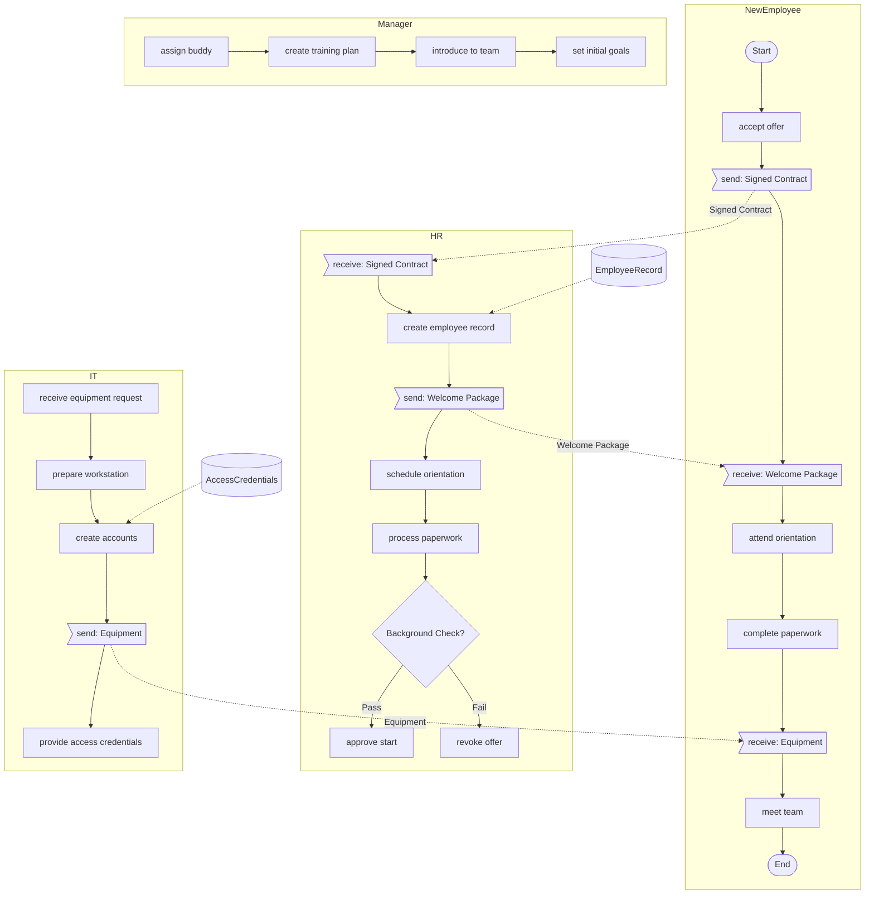
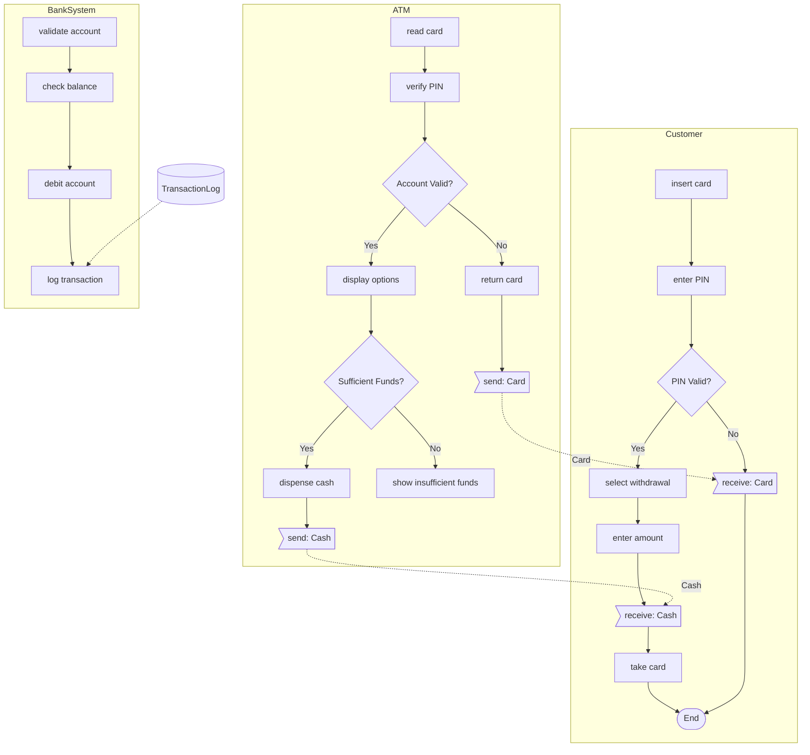
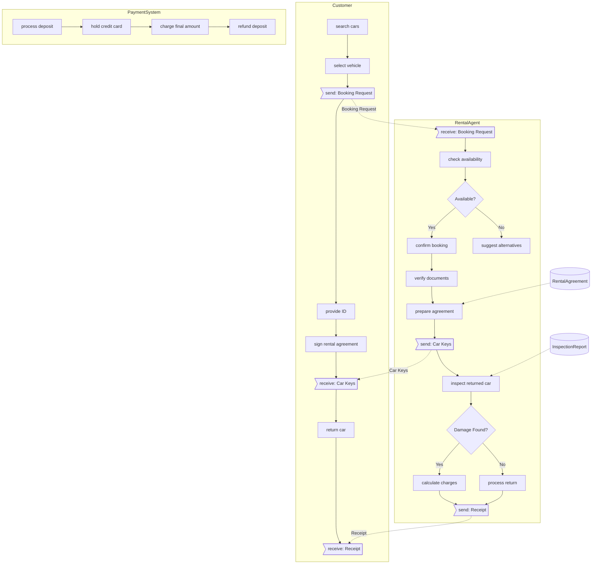

# BPMN-Lite Editor

A revolutionary way to create business process diagrams - write in plain text, see beautiful diagrams instantly! 🚀

<p align="center">
  
  
  
</p>

## 🎯 Why BPMN-Lite?

Stop wrestling with complex diagramming tools! BPMN-Lite lets you describe business processes in simple, intuitive text that automatically transforms into professional diagrams.

```
@Customer
  place order
  send: Payment
  receive: Confirmation

@System  
  receive: Payment
  ?Payment Valid
    +ship order
    -cancel order
  send: Confirmation
```

**↓ Instantly becomes ↓**

A beautiful, interactive BPMN diagram!

## ✨ Key Features

### 📝 **Simple DSL Syntax**
Write business processes in plain text - no XML, no drag-and-drop, just intuitive notation

### 👁️ **Live Preview** 
See your diagram update in real-time as you type (with VS Code extension!)

### 🎭 **Multiple Views**
Switch between:
- 📊 **Diagram View** - Interactive Mermaid flowchart
- 🌳 **AST View** - Understand the parsed structure
- 📜 **Mermaid Code** - Export-ready diagram syntax

### 🔀 **Smart Connectivity**
- **Gateway Support**: XOR decisions with custom branch labels
- **End Event Normalization**: Smart handling of `!End`, `+!End`, `-!End` variations
- **Auto-Connection Breaks**: Intelligent flow termination to prevent cross-lane leakage
- **Message Flows**: Automatic connection between send/receive tasks
- **Cross-Lane Flows**: Automatic sequential task connectivity with break detection
- **Data Objects**: Attach data to any process step

### 📤 **Export Options**
- `.bpl` - Source code format
- `.json` - Abstract Syntax Tree
- `.mmd` - Mermaid diagram code  
- `.png` - High-resolution PNG images (with custom DPI)
- `.svg` - Scalable vector graphics
- `.xlsx` - Excel format for Visio import
- `.bpmn` - Native BPMN 2.0 XML (Camunda 8 compatible)

## 🚀 Getting Started

### Option 1: Web-Based Editor (Easiest)

```bash
# Clone and setup
git clone <repository-url>
cd bpl
npm install
npm run build

# Launch in browser
npm run start:web
```

Open http://localhost:8080 and start creating!

### Option 2: Desktop Application

```bash
# Same setup as above, then:
npm start
```

### Option 3: VS Code Extension (Recommended!) 

Get the ultimate experience with live preview as you type:

```bash
cd vscode-bpmn-lite
npm install
npm run compile

# In VS Code: Press F5 to test
# Or package for installation:
npm run package
```

### Excel Export Setup (Optional)

```bash
cd tools
pip install -r requirements.txt
```

## 📖 DSL Quick Reference

### Core Elements

| Syntax | Element | Description |
|--------|---------|-------------|
| `:Process Name` | Process | Define the overall process |
| `@Department` | Lane/Pool | Group related activities |
| `  task name` | Task | Any indented line is a task |
| `?Decision` | Gateway | Decision point (XOR) |
| `+choice` | Positive Branch | Yes/True path |
| `-choice` | Negative Branch | No/False path |
| `!Start` / `!End` | Events | Process start/end points |

### Communication

| Syntax | Element | Description |
|--------|---------|-------------|
| `send: Message` | Send Task | Send a message |
| `receive: Message` | Receive Task | Wait for a message |
| `^Flow @A.task -> @B.task` | Message Flow | Explicit connection |

### Data & Annotations

| Syntax | Element | Description |
|--------|---------|-------------|
| `#DataObject task` | Data | Attach data to tasks |
| `"Comment text` | Annotation | Visible comment |
| `// Hidden comment` | Comment | Not shown in diagram |

### Advanced Features

```
# Custom gateway labels
?Payment Method
  +|Credit Card| process card payment
  +|PayPal| process PayPal
  -|Cancel| cancel transaction

# Direct connections
task A -> task C  # Skip task B
task D <- task B  # Reverse arrow
```

## Examples

### Simple Order Process

This basic example shows how intuitive it is to describe a business process:

```
:Order Process

@Customer
  place order
  send: Payment Information
  receive: Order Confirmation

@System
  receive: Payment Information
  validate payment
  ?Payment OK
    +ship order
    -cancel order
  send: Order Confirmation

#OrderData place order
```

**Renders as:**


### Restaurant Order Process

A simple restaurant ordering workflow:

**BPL Code:**
```
:Restaurant Order Process

@Customer
  enter restaurant
  read menu
  place order
  send: Order Details
  receive: Order Ready
  pay bill
  leave restaurant

@Waiter
  receive: Order Details
  send: Kitchen Order
  receive: Food Ready
  serve food
  send: Order Ready
  present bill

@Kitchen
  receive: Kitchen Order
  prepare food
  send: Food Ready

#OrderTicket place order
```

**Renders as Mermaid:**


### Software Development Sprint

A typical agile development sprint workflow:

**BPL Code:**
```
:Sprint Development Process

@ProductOwner
  define user stories
  prioritize backlog
  send: Sprint Goals
  review demo
  ?Accept Stories
    +update release notes
    -request changes

@Developer
  receive: Sprint Goals
  estimate tasks
  implement features
  send: Code Review Request
  receive: Review Feedback
  ?Tests Pass
    +deploy to staging
    -fix issues
  demo features

@QA
  receive: Code Review Request
  review code
  run tests
  send: Review Feedback
  ?Quality Check
    +approve release
    -report bugs

#SprintBacklog define user stories
#TestResults run tests
```

**Renders as Mermaid:**


### Complex E-Commerce Order Fulfillment

A more complex example showing multiple departments, parallel processes, and decision points:

```
:E-Commerce Order Fulfillment

@Customer
  !Start
  browse products
  add to cart
  checkout
  send: Payment Details
  send: Shipping Address
  receive: Order Confirmation
  receive: Tracking Number
  receive: Package
  rate experience
  !End

@OrderManagement
  receive: Payment Details
  receive: Shipping Address
  validate order
  ?Fraud Check
    +|Pass| process payment
    -|Fail| cancel order
  ?Payment Success
    +create fulfillment request
    -notify payment failure
  send: Order Confirmation

@Inventory
  check stock availability
  ?In Stock
    +|Available| reserve items
    +|Partial| split order
    -|Out of Stock| backorder items
  update inventory
  pack items

@Shipping
  receive fulfillment request
  ?Shipping Method
    +|Express| priority handling
    +|Standard| regular handling
    -|International| customs processing
  generate shipping label
  send: Tracking Number
  dispatch courier

@CustomerService
  monitor order status
  ?Customer Issue
    +resolve complaint
    -escalate to manager
  process returns
  send feedback survey

#OrderData checkout
#PaymentData process payment
#ShippingLabel generate shipping label
```

### Employee Onboarding Process

A complete HR onboarding workflow:

**BPL Code:**
```
:Employee Onboarding

@NewEmployee
  !Start
  accept offer
  send: Signed Contract
  receive: Welcome Package
  attend orientation
  complete paperwork
  receive: Equipment
  meet team
  !End

@HR
  receive: Signed Contract
  create employee record
  send: Welcome Package
  schedule orientation
  process paperwork
  ?Background Check
    +|Pass| approve start
    -|Fail| revoke offer

@IT
  receive equipment request
  prepare workstation
  create accounts
  send: Equipment
  provide access credentials

@Manager
  assign buddy
  create training plan
  introduce to team
  set initial goals

#EmployeeRecord create employee record
#AccessCredentials create accounts
```

**Renders as Mermaid:**


### Bank ATM Transaction

A simple ATM withdrawal process:

**BPL Code:**
```
:ATM Cash Withdrawal

@Customer
  insert card
  enter PIN
  ?PIN Valid
    +select withdrawal
    +enter amount
    +receive: Cash
    +take card
    -receive: Card
  !End

@ATM
  read card
  verify PIN
  ?Account Valid
    +display options
    +?Sufficient Funds
      +dispense cash
      +send: Cash
      -show insufficient funds
    -return card
  send: Card
  
@BankSystem
  validate account
  check balance
  debit account
  log transaction

#TransactionLog log transaction
```

**Renders as Mermaid:**


### IT Incident Management Process

This example demonstrates how BPMN-Lite handles service desk workflows with multiple teams:

```
:IT Incident Management

@User
  !Start
  report issue
  send: Incident Details
  receive: Ticket Number
  receive: Status Updates
  ?Resolved
    +confirm resolution
    -provide more info
  !End

@ServiceDesk
  receive: Incident Details
  create ticket
  send: Ticket Number
  categorize incident
  ?Priority
    +|Critical| escalate immediately
    +|High| assign to specialist
    +|Medium| queue for team
    -|Low| self-service guide
  
@L1Support
  receive ticket
  initial diagnosis
  ?Can Resolve
    +apply fix
    -escalate to L2
  document solution
  send: Status Updates

@L2Support
  deep investigation
  ?Root Cause Found
    +implement solution
    -escalate to vendor
  test resolution
  update knowledge base

@Management
  receive escalations
  ?Major Incident
    +convene war room
    -monitor progress
  approve changes
  send communications

^IncidentFlow @User.report issue -> @ServiceDesk.receive: Incident Details
#TicketData create ticket
#KnowledgeBase update knowledge base
```

### Car Rental Process

A streamlined car rental workflow:

**BPL Code:**
```
:Car Rental Service

@Customer
  search cars
  select vehicle
  send: Booking Request
  provide ID
  sign rental agreement
  receive: Car Keys
  return car
  receive: Receipt

@RentalAgent
  receive: Booking Request
  check availability
  ?Available
    +confirm booking
    +verify documents
    +prepare agreement
    +send: Car Keys
    -suggest alternatives
  inspect returned car
  ?Damage Found
    +calculate charges
    -process return
  send: Receipt

@PaymentSystem
  process deposit
  hold credit card
  charge final amount
  refund deposit

#RentalAgreement prepare agreement
#InspectionReport inspect returned car
```

**Renders as Mermaid:**


### Online Course Enrollment

An e-learning platform enrollment process:

**BPL Code:**
```
:Course Enrollment Process

@Student
  browse courses
  ?Found Interest
    +select course
    +send: Enrollment Request
    +receive: Payment Link
    +make payment
    +receive: Access Credentials
    +start learning
    -continue browsing

@Platform
  receive: Enrollment Request
  check prerequisites
  ?Prerequisites Met
    +send: Payment Link
    +receive: Payment Confirmation
    +create student account
    +enroll in course
    +send: Access Credentials
    -send: Prerequisites Info

@Instructor
  receive new enrollment
  send welcome message
  monitor progress
  provide feedback

#CourseContent enroll in course
#StudentProgress monitor progress
```

**Renders as Mermaid:**


### Loan Application Process

A financial process example with multiple decision points and compliance checks:

```
:Loan Application Process

@Applicant
  !Start
  submit application
  send: Financial Documents
  receive: Information Request
  provide additional info
  receive: Decision
  ?Approved
    +sign agreement
    +receive: Funds
    -seek alternatives
  !End

@LoanOfficer
  receive application
  receive: Financial Documents
  initial review
  ?Complete Application
    +proceed to verification
    -send: Information Request
  
@CreditDepartment
  run credit check
  analyze debt ratio
  ?Credit Score
    +|Excellent| fast track
    +|Good| standard process
    +|Fair| additional review
    -|Poor| recommend rejection
  calculate loan terms

@RiskAssessment
  evaluate application
  check fraud indicators
  ?Risk Level
    +|Low| approve
    +|Medium| add conditions
    -|High| reject
  set interest rate

@Underwriting
  final review
  ?Decision
    +prepare agreement
    -prepare rejection letter
  send: Decision

@Disbursement
  receive signed agreement
  verify conditions met
  transfer funds
  send: Funds
  setup payment schedule

#ApplicationData submit application
#CreditReport run credit check
#LoanAgreement prepare agreement
```

### Healthcare Patient Journey

This example shows a patient's journey through a healthcare system:

```
:Patient Emergency Room Visit

@Patient
  !Start
  arrive at ER
  check in
  provide symptoms
  receive: Triage Number
  wait for call
  receive: Treatment
  receive: Discharge Instructions
  !End

@Reception
  register patient
  verify insurance
  create patient record
  send: Triage Number
  
@TriageNurse
  assess symptoms
  take vitals
  ?Severity
    +|Critical| immediate care
    +|Urgent| priority queue
    +|Standard| general queue
    -|Non-urgent| refer to clinic
  assign to doctor

@Doctor
  examine patient
  order tests
  review results
  ?Diagnosis
    +prescribe treatment
    -order more tests
  ?Admission Required
    +admit to ward
    -prepare discharge

@Laboratory
  receive test orders
  collect samples
  run tests
  send results
  
@Pharmacy
  receive prescription
  verify dosage
  dispense medication
  provide instructions

@Billing
  compile charges
  submit to insurance
  ?Coverage
    +process payment
    -bill patient
  close account

^TestOrder @Doctor.order tests -> @Laboratory.receive test orders
#PatientRecord create patient record
#TestResults send results
#InsuranceClaim submit to insurance
```

### Manufacturing Quality Control

A manufacturing process with quality gates and rework loops:

```
:Manufacturing Quality Control Process

@Production
  !Start
  receive work order
  pull raw materials
  setup machinery
  produce batch
  send: Batch for QC

@QualityControl
  receive: Batch for QC
  inspect samples
  run tests
  ?Quality Check
    +|Pass| approve batch
    +|Minor Issues| conditional release
    -|Fail| reject batch
  document results

@Rework
  receive rejected batch
  analyze defects
  ?Fixable
    +repair items
    +send: Batch for QC
    -scrap batch
  update process

@Packaging
  receive approved batch
  package products
  label containers
  ?Final Inspection
    +release to warehouse
    -hold for review

@Warehouse
  receive products
  update inventory
  ?Order Pending
    +ship immediately
    -store in location
  !End

@Engineering
  receive quality reports
  analyze trends
  ?Process Issue
    +modify procedures
    -continue monitoring
  update specifications

#WorkOrder receive work order
#QualityReport document results
#InventorySystem update inventory
```

## 🏗️ Architecture & Development

### Project Structure
```
bpl/
├── src/index.html        # Main application (parser + UI)
├── main.js              # Electron entry point
├── vscode-bpmn-lite/    # VS Code extension
│   ├── src/            # Extension source code
│   └── bpmn-lite-0.1.0.vsix  # Ready-to-install package
├── tools/              # Export utilities
└── samples/            # Example .bpl files
```

### Key Components
- **Parser**: `BpmnLiteParser` class - Converts DSL to AST
- **Renderer**: Mermaid.js - Transforms AST to diagrams
- **Extension**: TypeScript VS Code integration with live preview

### Building from Source

```bash
# Main application
npm install
npm run build

# VS Code extension
cd vscode-bpmn-lite
npm install
npm run compile
npm run package  # Creates .vsix file

# All platforms
npm run dist:all
```

## 🔄 Export & Integration

### Export to Visio
1. Click "Save .xlsx" in the editor
2. Open in Visio: Data → Link Data to Shapes
3. Map columns automatically

### Future Integrations
- **BPMN 2.0 XML**: Native bpmn.io support (in development)
- **Camunda Integration**: Direct process deployment
- **API Access**: REST endpoints for automation

## 🐛 Known Limitations

- XOR gateways only (AND/OR coming soon)
- Excel export requires Python
- BPMN 2.0 export in development

## 🎨 VS Code Extension

Experience the **ultimate BPMN-Lite workflow** with our VS Code extension featuring live preview!

### ✨ Extension Features

- **🔴 Live Preview**: Diagram updates instantly as you type - no save required!
- **🎨 Syntax Highlighting**: Full IntelliSense and color coding for all DSL elements
- **📊 Split View**: Edit code and see diagram side-by-side
- **⚡ Real-time Validation**: Instant error detection and highlighting
- **📤 Quick Export**: Export to Mermaid or JSON with one click
- **🎯 Auto-complete**: Coming soon!

### 📦 Installation

#### Quick Install (Recommended)
```bash
# The extension is already built!
code --install-extension vscode-bpmn-lite/bpmn-lite-0.1.1.vsix
```

#### Development Install
1. Open VS Code in the `vscode-bpmn-lite` folder
2. Press `F5` to launch Extension Development Host
3. Open any `.bpl` file - preview appears automatically!

### 🎮 Usage

1. Create a new file with `.bpl` extension
2. Start typing - the preview panel opens automatically
3. Use `Ctrl+Shift+P` → "BPMN-Lite: Show Preview to Side" for split view
4. Your diagram updates live as you type!

[Full extension documentation](vscode-bpmn-lite/README.md)

## 🤝 Contributing

We welcome contributions! Here's how you can help:

- **🐛 Report Bugs**: Open an issue with reproduction steps
- **💡 Suggest Features**: Share your ideas in discussions
- **📝 Improve Docs**: Help us make the documentation better
- **🔧 Submit PRs**: Fork, branch, code, test, and submit!

### Development Workflow
```bash
git checkout -b feature/amazing-feature
npm test  # Run tests
git commit -m 'Add amazing feature'
git push origin feature/amazing-feature
```

## 📄 License

MIT License - see [LICENSE](LICENSE) file for details

---

<p align="center">
  Made with ❤️ by the BPMN-Lite team<br>
  <strong>Transform your business processes today!</strong>
</p>