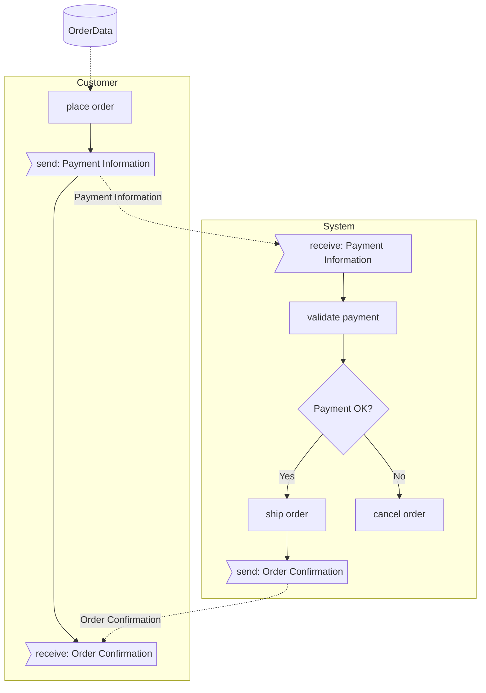

# BPMN-Lite Editor

A minimal, intuitive domain-specific language (DSL) for describing business process diagrams with visual rendering and export capabilities.

## Overview

BPMN-Lite Editor is a lightweight tool that allows you to create business process diagrams using a simple text-based syntax. The editor parses your DSL code into an Abstract Syntax Tree (AST) and renders it as a Mermaid flowchart. It supports both web-based and desktop (Electron) deployment.

## Current Development Status

- **Parser Implementation**: Custom JavaScript parser (not tree-sitter)
- **Rendering**: Mermaid.js for diagram visualization
- **Platform**: Electron desktop app + web-based editor
- **Export Formats**: BPL (source), JSON (AST), Mermaid, Excel (Visio-compatible)
- **Build Status**: ✅ Working

## Features

- **Simple DSL Syntax**: Write business processes in plain text
- **Live Preview**: See your diagram update as you type
- **Multiple Views**: Switch between Diagram, AST, and Mermaid code views
- **Gateway Support**: XOR gateways with custom branch labels
- **Message Flows**: Automatic connection between send/receive tasks
- **Data Objects**: Attach data to process steps
- **Cross-Lane Flows**: Automatic sequential connectivity
- **Export Options**:
  - `.bpl` - Source code format
  - `.json` - Abstract Syntax Tree
  - `.mmd` - Mermaid diagram code
  - `.xlsx` - Excel format for Visio import

## Installation

### Prerequisites

- Node.js v14+ and npm v6+
- Python 3.6+ (only for Excel export)

### Quick Start

```bash
# Clone the repository
git clone <repository-url>
cd bpl

# Install dependencies
npm install

# Build the project
npm run build

# Start the Electron app
npm start

# Or start web server
npm run start:web
```

### Python Dependencies (for Excel export)

```bash
cd tools
pip install -r requirements.txt
```

## DSL Syntax

### Basic Structure

```
:Process Name

@Lane1
  task 1
  task 2

@Lane2
  task 3
  task 4
```

### Task Types

```
# Regular task
do something

# Send message
send: Message Name

# Receive message
receive: Message Name

# Gateway
?Decision Point
  +positive branch
  -negative branch

# Data object
#DataName task reference

# Comment
"This appears in the diagram
```

### Connections

```
# Sequential (automatic within lanes)
task 1
task 2

# Explicit connections
task A -> task C
task B <- task D

# Message flows
^MessageName @Lane1.task -> @Lane2.task
```

## Examples

### Simple Order Process

This basic example shows how intuitive it is to describe a business process:

```
:Order Process

@Customer
  place order
  send: Payment Information
  receive: Order Confirmation

@System
  receive: Payment Information
  validate payment
  ?Payment OK
    +ship order
    -cancel order
  send: Order Confirmation

#OrderData place order
```

**Renders as:**



### Complex E-Commerce Order Fulfillment

A more complex example showing multiple departments, parallel processes, and decision points:

```
:E-Commerce Order Fulfillment

@Customer
  !Start
  browse products
  add to cart
  checkout
  send: Payment Details
  send: Shipping Address
  receive: Order Confirmation
  receive: Tracking Number
  receive: Package
  rate experience
  !End

@OrderManagement
  receive: Payment Details
  receive: Shipping Address
  validate order
  ?Fraud Check
    +|Pass| process payment
    -|Fail| cancel order
  ?Payment Success
    +create fulfillment request
    -notify payment failure
  send: Order Confirmation

@Inventory
  check stock availability
  ?In Stock
    +|Available| reserve items
    +|Partial| split order
    -|Out of Stock| backorder items
  update inventory
  pack items

@Shipping
  receive fulfillment request
  ?Shipping Method
    +|Express| priority handling
    +|Standard| regular handling
    -|International| customs processing
  generate shipping label
  send: Tracking Number
  dispatch courier

@CustomerService
  monitor order status
  ?Customer Issue
    +resolve complaint
    -escalate to manager
  process returns
  send feedback survey

#OrderData checkout
#PaymentData process payment
#ShippingLabel generate shipping label
```

### IT Incident Management Process

This example demonstrates how BPMN-Lite handles service desk workflows with multiple teams:

```
:IT Incident Management

@User
  !Start
  report issue
  send: Incident Details
  receive: Ticket Number
  receive: Status Updates
  ?Resolved
    +confirm resolution
    -provide more info
  !End

@ServiceDesk
  receive: Incident Details
  create ticket
  send: Ticket Number
  categorize incident
  ?Priority
    +|Critical| escalate immediately
    +|High| assign to specialist
    +|Medium| queue for team
    -|Low| self-service guide
  
@L1Support
  receive ticket
  initial diagnosis
  ?Can Resolve
    +apply fix
    -escalate to L2
  document solution
  send: Status Updates

@L2Support
  deep investigation
  ?Root Cause Found
    +implement solution
    -escalate to vendor
  test resolution
  update knowledge base

@Management
  receive escalations
  ?Major Incident
    +convene war room
    -monitor progress
  approve changes
  send communications

^IncidentFlow @User.report issue -> @ServiceDesk.receive: Incident Details
#TicketData create ticket
#KnowledgeBase update knowledge base
```

### Loan Application Process

A financial process example with multiple decision points and compliance checks:

```
:Loan Application Process

@Applicant
  !Start
  submit application
  send: Financial Documents
  receive: Information Request
  provide additional info
  receive: Decision
  ?Approved
    +sign agreement
    +receive: Funds
    -seek alternatives
  !End

@LoanOfficer
  receive application
  receive: Financial Documents
  initial review
  ?Complete Application
    +proceed to verification
    -send: Information Request
  
@CreditDepartment
  run credit check
  analyze debt ratio
  ?Credit Score
    +|Excellent| fast track
    +|Good| standard process
    +|Fair| additional review
    -|Poor| recommend rejection
  calculate loan terms

@RiskAssessment
  evaluate application
  check fraud indicators
  ?Risk Level
    +|Low| approve
    +|Medium| add conditions
    -|High| reject
  set interest rate

@Underwriting
  final review
  ?Decision
    +prepare agreement
    -prepare rejection letter
  send: Decision

@Disbursement
  receive signed agreement
  verify conditions met
  transfer funds
  send: Funds
  setup payment schedule

#ApplicationData submit application
#CreditReport run credit check
#LoanAgreement prepare agreement
```

### Healthcare Patient Journey

This example shows a patient's journey through a healthcare system:

```
:Patient Emergency Room Visit

@Patient
  !Start
  arrive at ER
  check in
  provide symptoms
  receive: Triage Number
  wait for call
  receive: Treatment
  receive: Discharge Instructions
  !End

@Reception
  register patient
  verify insurance
  create patient record
  send: Triage Number
  
@TriageNurse
  assess symptoms
  take vitals
  ?Severity
    +|Critical| immediate care
    +|Urgent| priority queue
    +|Standard| general queue
    -|Non-urgent| refer to clinic
  assign to doctor

@Doctor
  examine patient
  order tests
  review results
  ?Diagnosis
    +prescribe treatment
    -order more tests
  ?Admission Required
    +admit to ward
    -prepare discharge

@Laboratory
  receive test orders
  collect samples
  run tests
  send results
  
@Pharmacy
  receive prescription
  verify dosage
  dispense medication
  provide instructions

@Billing
  compile charges
  submit to insurance
  ?Coverage
    +process payment
    -bill patient
  close account

^TestOrder @Doctor.order tests -> @Laboratory.receive test orders
#PatientRecord create patient record
#TestResults send results
#InsuranceClaim submit to insurance
```

### Manufacturing Quality Control

A manufacturing process with quality gates and rework loops:

```
:Manufacturing Quality Control Process

@Production
  !Start
  receive work order
  pull raw materials
  setup machinery
  produce batch
  send: Batch for QC

@QualityControl
  receive: Batch for QC
  inspect samples
  run tests
  ?Quality Check
    +|Pass| approve batch
    +|Minor Issues| conditional release
    -|Fail| reject batch
  document results

@Rework
  receive rejected batch
  analyze defects
  ?Fixable
    +repair items
    +send: Batch for QC
    -scrap batch
  update process

@Packaging
  receive approved batch
  package products
  label containers
  ?Final Inspection
    +release to warehouse
    -hold for review

@Warehouse
  receive products
  update inventory
  ?Order Pending
    +ship immediately
    -store in location
  !End

@Engineering
  receive quality reports
  analyze trends
  ?Process Issue
    +modify procedures
    -continue monitoring
  update specifications

#WorkOrder receive work order
#QualityReport document results
#InventorySystem update inventory
```

## Building from Source

```bash
# Install dependencies
npm install

# Build distribution files
npm run build

# Create portable Windows package
./create-portable.sh

# Build installers for all platforms
npm run dist:all
```

## Testing

Currently, there are no automated tests. The application includes manual test cases in the source code that run on page load.

## Architecture

- **Parser**: `BpmnLiteParser` class in `src/index.html`
- **Main Process**: `main.js` - Electron application entry
- **Build System**: `build.js` - Copies files to dist/
- **Export Tools**: `tools/ast_to_visio.py` - Excel export

## Export to Visio

1. Create your diagram in the editor
2. Click "Save .xlsx" 
3. Open Excel file in Visio:
   - Data → Link Data to Shapes
   - Select the "Visio_01" named range
   - Map columns to shape properties

## Known Issues

- No automated test suite
- Excel export requires Python installation
- Limited to XOR gateways (no AND/OR gateways)

## Contributing

1. Fork the repository
2. Create a feature branch
3. Make your changes
4. Submit a pull request

## License

MIT License - see LICENSE file for details